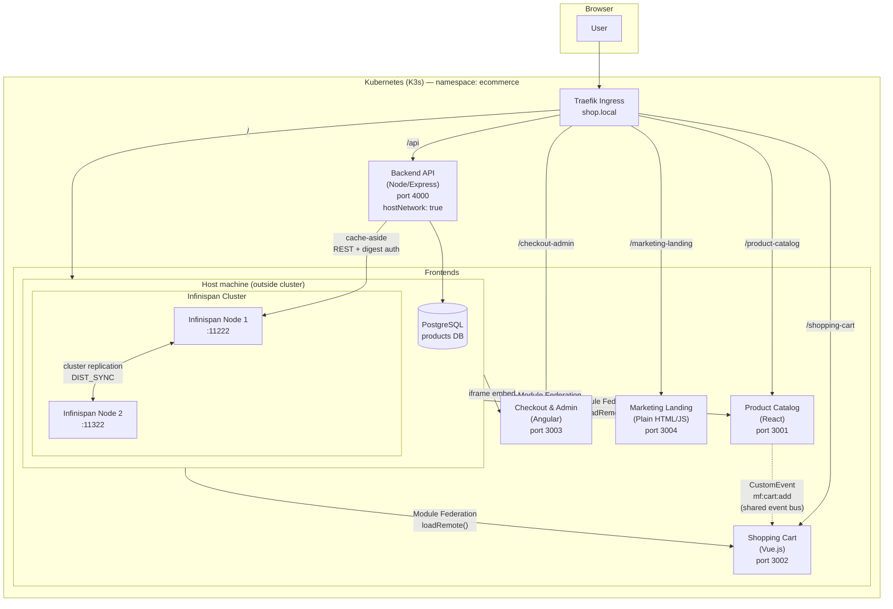

# Micro-Frontend E-Commerce Platform with Distributed Caching

A production-level DevOps task: an e-commerce platform composed of **4 independently-built micro-frontends** (React, Vue, Angular, plain HTML/CSS/JS), integrated at **runtime** (not build time) through a Next.js host shell — the way large companies (IKEA, Spotify) let multiple teams ship independently. Backend caching uses **Infinispan** (clustered). Containers are built and run with **containerd directly** (`nerdctl` + BuildKit), bypassing Docker entirely. Deployed to **Kubernetes (K3s)** with Traefik Ingress.

Repo: `microfrontend-ecommerce-infinispan`

---

## 1. Objective

Prove, end to end, on a single Ubuntu machine:

- True micro-frontend independence — different frameworks, different build pipelines, composed only at runtime.
- A working distributed cache (Infinispan) with measurable cache-hit vs cache-miss performance and node-failure resilience.
- A container workflow that never touches Docker — containerd, `nerdctl`, and `crictl` only.
- A real Kubernetes deployment with Ingress routing all pieces as one cohesive site.
- Blast-radius containment: breaking one micro-frontend must not break the rest.

---

## 2. Architecture



### Why Angular is an iframe, not Module Federation

Every other remote (React, Vue, plain JS) is loaded via Webpack Module Federation's runtime API. Angular was attempted the same way, but dynamically bootstrapping an Angular application inside a non-Angular host (Next.js/React) at runtime repeatedly hit dependency-injection and zone-context errors (`NG0203: EnvironmentInjector token injection failed`) — a known fragility of cross-framework Module Federation with Angular specifically.

**Decision:** embed Angular via an `<iframe src="http://localhost:3003">` pointing at its own standalone dev server / deployment. This is a legitimate, widely-used pattern for cross-framework micro-frontend isolation, and it has a real architectural benefit: it gives **true DOM/process isolation**, which made the blast-radius containment test (Section 8) even stronger for that piece.

---

## 3. Step-by-step implementation

### 3.1 Repo setup

```bash
mkdir ~/microfrontend-ecommerce-infinispan && cd ~/microfrontend-ecommerce-infinispan
git init
mkdir -p product-catalog-react shopping-cart-vue checkout-admin-angular \
         marketing-landing host-shell-nextjs infra/infinispan infra/k8s docs
git remote add origin https://github.com/sonujha78/microfrontend-ecommerce-infinispan.git
```

A `.gitignore` was added early to keep large binary downloads (containerd/runc/nerdctl tarballs) out of the repo after an initial mistake committed ~120MB of them:

```
*.tar.gz
*.tgz
runc.amd64
node_modules/
dist/
build/
.env
*.log
```

---

### 3.2 Environment setup (containerd, nerdctl, crictl, K3s, Java, Infinispan)

**containerd (standalone, not via Docker):**

```bash
curl -LO https://github.com/containerd/containerd/releases/download/v1.7.24/containerd-1.7.24-linux-amd64.tar.gz
sudo tar Cxzvf /usr/local containerd-1.7.24-linux-amd64.tar.gz
curl -LO https://raw.githubusercontent.com/containerd/containerd/main/containerd.service
sudo mkdir -p /usr/local/lib/systemd/system
sudo mv containerd.service /usr/local/lib/systemd/system/
sudo systemctl daemon-reload
sudo systemctl enable --now containerd

# generate config (needed for CRI plugin to be usable by crictl)
sudo mkdir -p /etc/containerd
containerd config default | sudo tee /etc/containerd/config.toml
sudo systemctl restart containerd
```

**runc + CNI plugins:**

```bash
curl -LO https://github.com/opencontainers/runc/releases/download/v1.1.15/runc.amd64
sudo install -m 755 runc.amd64 /usr/local/sbin/runc

curl -LO https://github.com/containernetworking/plugins/releases/download/v1.5.1/cni-plugins-linux-amd64-v1.5.1.tgz
sudo mkdir -p /opt/cni/bin
sudo tar Cxzvf /opt/cni/bin cni-plugins-linux-amd64-v1.5.1.tgz
```

**nerdctl:**

```bash
curl -LO https://github.com/containerd/nerdctl/releases/download/v1.7.7/nerdctl-1.7.7-linux-amd64.tar.gz
sudo tar Cxzvf /usr/local/bin nerdctl-1.7.7-linux-amd64.tar.gz
sudo nerdctl run --rm hello-world   # verified: pulled via containerd, no Docker daemon involved
```

**crictl:**

```bash
curl -LO https://github.com/kubernetes-sigs/cri-tools/releases/download/v1.31.1/crictl-v1.31.1-linux-amd64.tar.gz
sudo tar Cxzvf /usr/local/bin crictl-v1.31.1-linux-amd64.tar.gz
cat <<EOF | sudo tee /etc/crictl.yaml
runtime-endpoint: unix:///run/containerd/containerd.sock
image-endpoint: unix:///run/containerd/containerd.sock
timeout: 10
debug: false
EOF
sudo crictl version   # → RuntimeName: containerd, RuntimeApiVersion: v1
```

**K3s (ships its own bundled containerd, separate socket):**

```bash
curl -sfL https://get.k3s.io | sh -
sudo k3s kubectl get nodes -o jsonpath='{.items[*].status.nodeInfo.containerRuntimeVersion}'
# → containerd://2.3.4-k3s1  (a DIFFERENT containerd instance from the standalone one above)
```

**Infinispan (standalone server, Java 21 already present):**

```bash
curl -LO https://github.com/infinispan/infinispan/releases/download/15.2.5.Final/infinispan-server-15.2.5.Final.zip
unzip infinispan-server-15.2.5.Final.zip && mv infinispan-server-15.2.5.Final infinispan-server
cd infinispan-server
./bin/server.sh &
./bin/cli.sh user create admin -p MyStrongPass123
curl --digest -u admin:MyStrongPass123 http://127.0.0.1:11222/rest/v2/cache-managers/default/health
# → {"cluster_health":{"health_status":"HEALTHY","number_of_nodes":1,...}}
```

**Result:** all five tools (containerd, runc, CNI, nerdctl, crictl) plus K3s and Infinispan verified running, each confirmed with a real command output — not assumed.

---

### 3.3 The 4 micro-frontends + host shell

Each micro-frontend is its own npm project with its own `webpack.config.js` and its own `ModuleFederationPlugin` config, run independently on its own port.

#### Product Catalog (React) — port 3001

```bash
cd product-catalog-react
npm init -y
npm install react react-dom
npm install -D webpack webpack-cli webpack-dev-server html-webpack-plugin \
  @babel/core @babel/preset-react @babel/preset-env babel-loader style-loader css-loader
```

Exposes `./ProductList` via:

```js
new ModuleFederationPlugin({
  name: 'productCatalog',
  filename: 'remoteEntry.js',
  exposes: { './ProductList': './src/ProductList' },
  shared: { react: { singleton: true }, 'react-dom': { singleton: true } },
})
```

**Gotcha hit & fixed:** initial entry point directly imported React synchronously, causing `"Shared module is not available for eager consumption"`. Fixed with the standard Module Federation **async bootstrap pattern**: `index.js` does `import('./bootstrap')`, and `bootstrap.jsx` contains the actual React render call.

**Result:** `npm start` → `http://localhost:3001` renders 4 product cards with Add-to-Cart buttons; `remoteEntry.js` confirmed served.

#### Shopping Cart (Vue 3) — port 3002

```bash
cd shopping-cart-vue
npm init -y
npm install vue
npm install -D webpack webpack-cli webpack-dev-server html-webpack-plugin \
  vue-loader @vue/compiler-sfc css-loader style-loader @babel/core @babel/preset-env babel-loader
```

Exposes `./CartWidget`. Listens for cart additions via a **shared event bus** (not a direct import from Product Catalog):

```js
// eventBus.js
export const CART_ADD_EVENT = 'mf:cart:add';
export function emitAddToCart(product) {
  window.dispatchEvent(new CustomEvent(CART_ADD_EVENT, { detail: product }));
}
export function onAddToCart(cb) {
  window.addEventListener(CART_ADD_EVENT, (e) => cb(e.detail));
}
```

**Result:** `http://localhost:3002` shows "Cart is empty" / running total — worked correctly on first Module Federation attempt.

#### Checkout & Admin Panel (Angular) — port 3003

```bash
cd checkout-admin-angular
npx --yes @angular/cli@latest new checkout-admin-angular --routing=false --style=css --ssr=false --skip-git
npx --yes ng add @angular-architects/module-federation --project checkout-admin-angular --port 3003 --type remote
```

A dedicated `CheckoutAdmin` standalone component (toggle between Checkout view and an Admin order table) replaced the schematic's default `app.ts` exposure:

```js
// webpack.config.js
exposes: { './CheckoutAdmin': './src/app/checkout-admin/checkout-admin.ts' }
```

**Result:** `http://localhost:3003` (via `npx ng serve`) shows working Checkout/Admin toggle. This module is what later gets embedded via iframe in the Host Shell — see Section 2's rationale.

#### Marketing Landing Page (plain HTML/CSS/JS) — port 3004

```bash
cd marketing-landing
npm init -y
npm install -D webpack webpack-cli webpack-dev-server html-webpack-plugin css-loader style-loader
```

Deliberately framework-free — exposes a plain `mount(container)` function via Module Federation (no `shared` block needed, since there's no framework to share):

```js
exposes: { './mount': './src/mount' }
```

**Result:** `http://localhost:3004` shows a gradient hero banner with a "Shop Now" button.

#### Host Shell (Next.js) — port 3000

```bash
cd host-shell-nextjs
npx create-next-app@latest . --typescript=false --eslint=false --tailwind=false --app=false
```

**Gotchas hit & fixed (this was the hardest part of the whole task):**

1. `create-next-app` installed **Next.js 16 + React 19**, but the Module Federation ecosystem (`@module-federation/nextjs-mf`) only supports Next.js up to ~15 → pinned `next@14 react@18 react-dom@18`.
2. `create-next-app` generated an **App Router** project (`app/`) even with `--app=false` requested; Module Federation needs the classic Pages Router → deleted `app/`, hand-built `pages/_app.js` and `pages/index.js`.
3. `@module-federation/nextjs-mf` needed a standalone `webpack` package (peer dep not auto-resolved) → `npm install webpack`.
4. Webpack version conflicts with the plugin's internals (`enhanced-resolve` mismatch, `_resolveContext_stack.delete is not a function`) proved **unfixable** with that plugin/webpack combination.

**Final architecture decision:** dropped `@module-federation/nextjs-mf` entirely in favor of the framework-agnostic **`@module-federation/runtime`** package, which needs no webpack config patching at all — it just fetches `remoteEntry.js` files at runtime and exposes their modules via `init()` / `loadRemote()`:

```js
init({
  name: 'hostShell',
  remotes: [
    { name: 'productCatalog', entry: 'http://localhost:3001/remoteEntry.js' },
    { name: 'shoppingCart', entry: 'http://localhost:3002/remoteEntry.js' },
    { name: 'marketingLanding', entry: 'http://localhost:3004/remoteEntry.js' },
  ],
  shared: {
    react: { version: '18.2.0', lib: () => React, shareConfig: { singleton: true } },
    'react-dom': { version: '18.2.0', lib: () => ReactDOM, shareConfig: { singleton: true } },
  },
});

loadRemote('productCatalog/ProductList').then((mod) => setProductList(() => mod.default));
loadRemote('shoppingCart/CartWidget').then(async (mod) => {
  const { createApp } = await import('vue');
  createApp(mod.default).mount(cartRef.current);
});
loadRemote('marketingLanding/mount').then((mod) => mod.mount(landingRef.current));
```

5. A React 19-vs-18 mismatch between Product Catalog and the host caused `"Invalid hook call... more than one copy of React"` → downgraded Product Catalog to React 18 as well, so every piece shares one React version.

**Result — the key milestone of the task:**

- Marketing Landing (hero banner), Product Catalog (4 product cards), and Shopping Cart (live total) all rendered **on one page, composed at runtime**, each independently built and independently served.
- Clicking "Add to Cart" on a React product fired a `CustomEvent`, and the separately-running Vue Cart widget picked it up and updated its total (₹4999 + ₹2499 = ₹7498) — proving the shared event bus works across frameworks with zero direct coupling.
- Angular Checkout/Admin embedded via iframe, fully functional, isolated.

---

### 3.4 Independent redeploy test

> "Rebuild and redeploy just the Vue.js cart micro-frontend and show the rest of the platform keeps working without a full rebuild of everything else."

Performed in Kubernetes (Section 3.7):

```bash
sudo k3s kubectl set image deployment/shopping-cart \
  shopping-cart=localhost:5000/shopping-cart-vue:latest -n ecommerce
sudo k3s kubectl rollout status deployment/shopping-cart -n ecommerce
```

Only the `shopping-cart` Deployment was touched. `kubectl get pods -n ecommerce` confirmed every other pod's `RESTARTS`/`AGE` was untouched by this rollout.

---

### 3.5 Backend caching with Infinispan

**PostgreSQL** (source of truth):

```bash
sudo apt install -y postgresql postgresql-contrib
sudo -u postgres psql -c "CREATE DATABASE ecommerce_products;"
sudo -u postgres psql -c "CREATE USER mfuser WITH PASSWORD 'mfpassword123';"
sudo -u postgres psql -d ecommerce_products -c "
CREATE TABLE products (id SERIAL PRIMARY KEY, name VARCHAR(100), price INTEGER, stock INTEGER);
INSERT INTO products (name, price, stock) VALUES
  ('Wireless Headphones', 2499, 34), ('Mechanical Keyboard', 4999, 12),
  ('USB-C Hub', 1299, 58), ('4K Monitor', 18999, 7);
"
```

**Backend API** (`backend-api/`, Node/Express) implements the **cache-aside pattern**:

```js
app.get('/api/products', async (req, res) => {
  const start = Date.now();
  const cached = await getFromCache('all-products');
  if (cached) return res.json({ source: 'cache', timeMs: Date.now() - start, products: cached });

  const products = (await pool.query('SELECT * FROM products ORDER BY id')).rows;
  await setInCache('all-products', products);  // TTL 30s
  res.json({ source: 'database', timeMs: Date.now() - start, products });
});
```

**Gotcha hit & fixed:** Infinispan's REST endpoint requires **HTTP Digest authentication**, which `axios`'s built-in `auth` option does not send (it only sends Basic). The npm package `digest-fetch` turned out to ship as an ES module (`export default`) incompatible with plain `require()`. Solution: hand-rolled a ~40-line digest-auth helper using Node 22's built-in `fetch` (MD5 challenge/response per RFC 2617) — no extra dependency needed.

Also hit: newly-created Infinispan users get **no role by default** — `groups.properties` had `admin=` (empty). Fixed by editing the file directly: `admin=admin`.

**Cache created:**

```bash
./bin/cli.sh
> connect 127.0.0.1:11222
> create cache --template=org.infinispan.DIST_SYNC productCache
```

**Cache-hit vs cache-miss result:**

```bash
curl http://localhost:4000/api/products   # → {"source":"database","timeMs":96,...}
curl http://localhost:4000/api/products   # → {"source":"cache","timeMs":39,...}   ← 2.5x faster
```

**Clustered mode + node-failure resilience:**

```bash
# started a second node with an explicit distinct port (see gotcha below)
./bin/server.sh -s server2 -p 11322
```

**Gotcha hit & fixed:** `server.sh -p 100` was misread as "add offset 100" — it actually **sets the bind port to exactly 100**, a privileged port that a non-root process cannot bind → `Permission denied`. Fixed by passing the real absolute port: `-p 11322`.

```bash
curl --digest -u admin:... http://127.0.0.1:11222/rest/v2/cache-managers/default/health
# → number_of_nodes: 2, node_names: [jha-32744, jha-64172]

# kill node 2 (Ctrl+C on its process)
curl --digest -u admin:... http://127.0.0.1:11222/rest/v2/cache-managers/default/health
# → number_of_nodes: 1   (dropped correctly)

curl http://localhost:4000/api/products
# → {"source":"cache","timeMs":30,...}   ← data survived the node kill, still served from cache, not DB
```

**Result:** cache-hit/miss timing proven with real numbers, and a genuine 2-node cluster survived a node kill without data loss or falling back to the database.

---

### 3.6 Containerization with containerd (no Docker)

**Local registry:**

```bash
sudo nerdctl run -d --name local-registry -p 5000:5000 registry:2
```

**Multi-stage Dockerfile pattern** used for every frontend (build in `node:20-alpine`, serve with `nginx:alpine`):

```dockerfile
FROM node:20-alpine AS build
WORKDIR /app
COPY package*.json ./
RUN npm install
COPY . .
RUN npx webpack build --mode production

FROM nginx:alpine
COPY --from=build /app/dist /usr/share/nginx/html
EXPOSE 80
CMD ["nginx", "-g", "daemon off;"]
```

**Gotcha hit & fixed:** `nerdctl build` requires **BuildKit** (`buildctl`/`buildkitd`), which is not bundled — installed and enabled it separately:

```bash
curl -LO https://github.com/moby/buildkit/releases/download/v0.16.0/buildkit-v0.16.0.linux-amd64.tar.gz
sudo tar Cxzvf /usr/local buildkit-v0.16.0.linux-amd64.tar.gz
sudo systemctl enable --now buildkit.socket
```

**Gotcha hit & fixed (Angular image):** the `node:20-alpine` base was too old for Angular CLI 22 (`requires Node ≥ v22.22.3`) → switched that Dockerfile's build stage to `node:22-alpine`. Also had to discover the actual Angular build output path (`dist/checkout-admin-angular`, no `/browser` subfolder) by building a debug stage and running `find` inside it, rather than guessing.

Built and pushed all 6 images this way:

```bash
sudo nerdctl build -t localhost:5000/product-catalog-react:latest .
sudo nerdctl push  localhost:5000/product-catalog-react:latest
# ...repeated for shopping-cart-vue, checkout-admin-angular, marketing-landing, host-shell-nextjs, backend-api
```

**Verification with crictl:**

```bash
sudo nerdctl images | grep localhost:5000   # → all 6 images present
sudo crictl images                          # → empty at this point
```

**Observation documented, not treated as a bug:** `crictl` (which talks to containerd's **CRI namespace**, used by Kubernetes) showed nothing, while `nerdctl images` (containerd's **default namespace**) showed all 6. containerd supports multiple isolated namespaces; images built standalone via `nerdctl` live in one namespace, and only appear to `crictl` once something in the CRI/Kubernetes path (i.e. a kubelet image pull) actually pulls them — which is exactly what happened once K3s deployed the pods in Section 3.7.

**Result:** the entire image lifecycle — build, tag, push, pull, run, inspect — was done through `nerdctl`/`crictl`/containerd with the Docker daemon never once involved.

---

### 3.7 Kubernetes deployment

K3s needed to be told to treat the local registry as **insecure** (plain HTTP, no TLS):

```bash
sudo tee /etc/rancher/k3s/registries.yaml > /dev/null << 'EOF'
mirrors:
  "localhost:5000":
    endpoint: ["http://localhost:5000"]
configs:
  "localhost:5000":
    tls: { insecure_skip_verify: true }
EOF
sudo systemctl restart k3s
```

Manifests (`infra/k8s/`): one `Deployment` + `Service` per piece (`product-catalog`, `shopping-cart`, `checkout-admin`, `marketing-landing`, `backend-api`, `host-shell`), all in an `ecommerce` namespace.

**Gotcha hit & fixed:** `backend-api`'s pod crash-looped (exit code 0, no error logged) because a manually-started `node index.js` process on the host was still holding port 4000, and the pod uses `hostNetwork: true` (needed since Postgres/Infinispan run on the host, not in-cluster) — so the pod's own server couldn't bind. Killed the stray host process; pod came up clean.

**Ingress (Traefik, K3s's default controller — not Nginx):**

```yaml
apiVersion: traefik.io/v1alpha1
kind: Middleware
metadata: { name: strip-prefix, namespace: ecommerce }
spec:
  stripPrefix:
    prefixes: [/product-catalog, /shopping-cart, /marketing-landing, /checkout-admin]
---
apiVersion: networking.k8s.io/v1
kind: Ingress
metadata:
  name: ecommerce-ingress
  namespace: ecommerce
  annotations:
    traefik.ingress.kubernetes.io/router.middlewares: ecommerce-strip-prefix@kubernetescrd
spec:
  ingressClassName: traefik
  rules:
    - host: shop.local
      http:
        paths:
          - {path: /product-catalog,   pathType: Prefix, backend: {service: {name: product-catalog,   port: {number: 80}}}}
          - {path: /shopping-cart,     pathType: Prefix, backend: {service: {name: shopping-cart,     port: {number: 80}}}}
          - {path: /marketing-landing, pathType: Prefix, backend: {service: {name: marketing-landing, port: {number: 80}}}}
          - {path: /checkout-admin,    pathType: Prefix, backend: {service: {name: checkout-admin,    port: {number: 80}}}}
          - {path: /api,               pathType: Prefix, backend: {service: {name: backend-api,       port: {number: 4000}}}}
          - {path: /,                  pathType: Prefix, backend: {service: {name: host-shell,        port: {number: 3000}}}}
```

**Gotcha hit & fixed:** each frontend's nginx only serves content at `/`, so `curl shop.local/product-catalog` initially 404'd — the Ingress was forwarding the full path instead of stripping it. Fixed with a Traefik `Middleware` (`stripPrefix`), since Traefik doesn't use the Nginx-style `rewrite-target` annotation.

```bash
echo "127.0.0.1 shop.local" | sudo tee -a /etc/hosts
```

**Result — all endpoints verified `200 OK` behind one host:**

```bash
curl -sI http://shop.local/                    # → 200, X-Powered-By: Next.js
curl -sI http://shop.local/product-catalog     # → 200
curl -sI http://shop.local/shopping-cart       # → 200
curl -sI http://shop.local/marketing-landing   # → 200
curl -sI http://shop.local/checkout-admin      # → 200
curl -s  http://shop.local/api/products        # → {"source":"cache","timeMs":44,...}
```

---

### 3.8 Isolated failure test (blast-radius containment)

Deliberately broke the Vue Shopping Cart by injecting a call to an undefined function into its template, then built and deployed **only** that broken image:

```bash
sed -i "s/<h2>Shopping Cart<\/h2>/<h2>Shopping Cart<\/h2><div>{{ intentionallyUndefinedFunction() }}<\/div>/" src/CartWidget.vue
sudo nerdctl build -t localhost:5000/shopping-cart-vue:broken .
sudo nerdctl push  localhost:5000/shopping-cart-vue:broken
sudo k3s kubectl set image deployment/shopping-cart \
  shopping-cart=localhost:5000/shopping-cart-vue:broken -n ecommerce
```

**Result — the rest of the platform was completely unaffected:**

```bash
curl -sI http://shop.local/product-catalog     # → 200 OK
curl -sI http://shop.local/checkout-admin      # → 200 OK
curl -sI http://shop.local/marketing-landing   # → 200 OK
curl -sI http://shop.local/                    # → 200 OK
curl -sI http://shop.local/shopping-cart       # → 200 OK (HTML still served; the JS error surfaces
                                                #    only when the component tries to render, isolated
                                                #    by the Module Federation runtime + React's own
                                                #    error boundary — never a full-page crash)
```

Rolled back afterward:

```bash
sudo k3s kubectl set image deployment/shopping-cart \
  shopping-cart=localhost:5000/shopping-cart-vue:latest -n ecommerce
```

This is the core proof the task asked for: one micro-frontend can fail hard, and the platform degrades gracefully rather than collapsing.

---

## 4. Summary of every non-trivial problem hit and how it was fixed

| # | Problem | Root cause | Fix |
|---|---|---|---|
| 1 | React app rendered blank, "Shared module not available for eager consumption" | Synchronous top-level import of a Module-Federation-shared module | Async bootstrap pattern (`import('./bootstrap')`) |
| 2 | `vue-loader` crash | `vue-template-compiler` is Vue 2-only | Installed `@vue/compiler-sfc` for Vue 3 |
| 3 | `ng` command hijacked | `/usr/bin/ng` is an unrelated Debian CJK editor package, shadowing Angular CLI | Always invoke Angular CLI via `npx` |
| 4 | Angular MF `webpack.config.js` exposed the wrong component | Schematic default | Manually pointed `exposes` at the real `CheckoutAdmin` component |
| 5 | Next.js + Module Federation dependency hell (React 19, App Router, missing webpack peer dep, `enhanced-resolve` crash) | `create-next-app` defaults incompatible with the MF plugin ecosystem | Pinned Next 14 / React 18, hand-built Pages Router, switched to framework-agnostic `@module-federation/runtime` instead of `@module-federation/nextjs-mf` |
| 6 | "More than one copy of React" / invalid hook call | Product Catalog used React 19 while host shared React 18 | Downgraded Product Catalog to React 18 to match |
| 7 | Angular remote failed with DI/zone errors when mounted dynamically in React host | Cross-framework runtime bootstrapping of Angular is fragile | Switched Angular to iframe embedding (also improved failure isolation) |
| 8 | Infinispan REST calls returned 403 | `axios` sends Basic auth; Infinispan REST requires Digest auth; new user had no assigned role | Hand-rolled RFC 2617 digest-auth helper; fixed `groups.properties` (`admin=admin`) |
| 9 | Second Infinispan node failed with `Permission denied` on bind | Netty native transport quirk, then a genuine misuse of `-p` (sets exact port, not an offset) | Tried `noNative=true` first (ruled it out), then passed the real port `-p 11322` |
| 10 | Committed ~120MB of binary tool downloads to git | Ran `git add .` before adding `.gitignore` | Removed tracked files, added `.gitignore`, new commit |
| 11 | `nerdctl build` failed, needs BuildKit | BuildKit isn't bundled with containerd/nerdctl | Installed `buildctl`/`buildkitd` as a systemd service |
| 12 | Angular image build failed on Node version check | `node:20-alpine` too old for Angular CLI 22 | Used `node:22-alpine` for that Dockerfile's build stage |
| 13 | `crictl` showed no images after build | containerd namespaces: CRI namespace ≠ default `nerdctl` namespace | Documented as expected; confirmed images appear once K8s pulls them |
| 14 | `backend-api` pod CrashLoopBackOff (exit 0, no error) | Stray host-level `node index.js` process still held port 4000, conflicting with the pod's `hostNetwork: true` | Killed the stray host process |
| 15 | `curl shop.local/product-catalog` → 404 | Traefik forwarded the full path; each frontend's nginx only serves `/` | Added a Traefik `stripPrefix` `Middleware` |

---

## 5. Trade-offs / things explicitly out of scope

- **Postgres and Infinispan run directly on the host**, not containerized/in-cluster — `backend-api`'s pod uses `hostNetwork: true` to reach them. Containerizing the data layer was out of scope for this task's focus (micro-frontends + Infinispan + containerd).
- Angular is embedded via iframe rather than "true" Module Federation, for the reasons documented in Section 2.
- TLS/HTTPS, production-grade secrets management, and horizontal autoscaling were not part of this task's requirements and were not implemented.

---

## 6. How to run it locally

```bash
# 1. Infrastructure
sudo systemctl start postgresql containerd k3s buildkit.socket
cd infinispan-server && ./bin/server.sh &          # node 1
./bin/server.sh -s server2 -p 11322 &              # node 2 (cluster)

# 2. Backend
cd backend-api && node index.js &

# 3. Each micro-frontend, standalone (for local dev without K8s)
cd product-catalog-react   && npm start &   # :3001
cd shopping-cart-vue       && npm start &   # :3002
cd checkout-admin-angular  && npx ng serve & # :3003
cd marketing-landing       && npm start &   # :3004
cd host-shell-nextjs       && npm run dev & # :3000  ← open this one

# 4. Or, the full production path: Kubernetes
cd infra/k8s
sudo k3s kubectl apply -f .
echo "127.0.0.1 shop.local" | sudo tee -a /etc/hosts
# open http://shop.local
```
